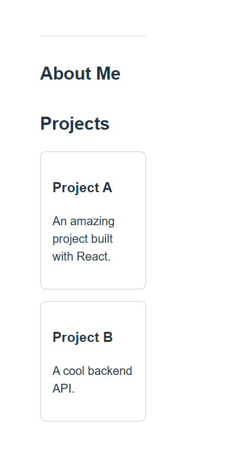

# 🌐 Magnolia Headless Portfolio (Mocked API + React)

This is a personal portfolio project built with a **headless CMS architecture** in mind. It simulates integration with **Magnolia CMS** using a mocked REST API and displays the content dynamically in a modern **React.js frontend**.

> ⚠️ Due to environment limitations, the Magnolia CMS backend is currently mocked using a local JSON server. The structure and API endpoints closely follow Magnolia’s headless REST output, and this app is fully prepared for future Magnolia integration.

---

## 📸 Preview

  
*Homepage showing title, bio, and projects from a CMS-style API*

---

## 🧠 Tech Stack

| Layer       | Tech                      | Purpose                                 |
|------------|---------------------------|-----------------------------------------|
| Frontend   | React.js                  | Dynamic UI rendering                    |
| Styling    | CSS / Tailwind (optional) | Styling and layout                      |
| Backend    | JSON Server (mock API)    | Simulated Magnolia REST API             |
| CMS (future)| Magnolia CMS (Headless)   | Planned real CMS integration            |

---

## 🚀 Features

- 🔌 **Dynamic content fetching** from REST API endpoints
- 🧠 Simulates Magnolia’s headless CMS behavior
- 📦 Component-based architecture (React)
- 🧪 Clean and easy to maintain structure
- 🛠️ Future-ready for Magnolia REST backend

---

## 🗂️ Folder Structure

magnolia-portfolio/
├── public/
├── src/
│ ├── components/
│ │ ├── Header.jsx
│ │ ├── Bio.jsx
│ │ └── ProjectList.jsx
│ └── App.jsx
├── mock-api/ # JSON files simulating Magnolia data
│ ├── title.json
│ ├── bio.json
│ └── projects.json

yaml
Copy
Edit

---

## 📁 API Endpoints (Mocked)

| Endpoint | Description                |
|----------|----------------------------|
| `/title`   | Portfolio owner name       |
| `/bio`     | Short biography            |
| `/projects`| List of projects (name + description) |

---

## 📦 Getting Started

### 1. Clone the repo

```bash
git clone https://github.com/salimbenslim1/magnolia-portfolio.git
cd magnolia-portfolio